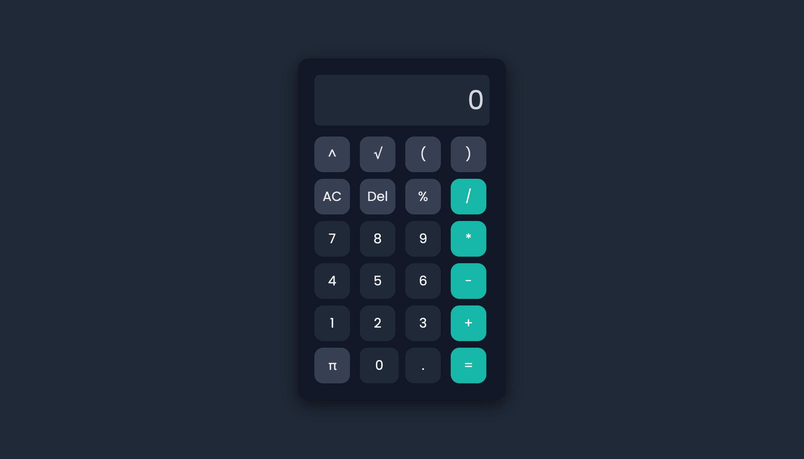

# Modern Calculator

A clean and responsive calculator built using HTML, CSS, and Vanilla JavaScript.

## 🚀 Live Demo

Add your deployed link here:

https://your-project-link.vercel.app

## ✨ Features

- Basic arithmetic operations (+, -, ×, ÷)
- Percentage calculation
- Power operation (xʸ)
- Square root (√)
- Pi (π) support
- Parentheses support
- Delete (Del) and All Clear (AC)
- Responsive dark UI
- Smooth button animations
- Mobile-friendly design

## 🛠️ Built With

- HTML5
- CSS3
- JavaScript (Vanilla JS)

## 📷 Screenshot



## 📂 Project Structure

```
Calculator/
│── index.html
│── style.css
│── script.js
│── README.md
```

## 🎯 Future Improvements

- Keyboard support
- Calculation history
- Theme switcher
- Scientific mode
- Better expression parser

## 👨‍💻 Author

Pranshu Singh
